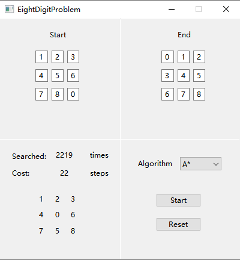
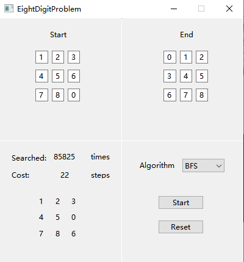

# EightDigitProblem

用C++Qt写的八数码问题
A Qt executable which can simulate the solution of eight digit problem.
I created this repository as a practice of Git for Windows.

学习了A*搜索，启发式搜索效率比之前学的盲目搜索高多了。但是怎么构造启发函数还是很难的，需要一点数学基础，当然也要脑子好。

这次的启发式函数f(x) = g(x) + h(x) ，其中g(x)是当前搜索的深度，这就像是dijkstra了，总是能保证在当前深度上是最优的。h(x)是用曼哈顿距离表示当前状态与目标状态的位置坐标差的和，因此这部分就可以让搜索的过程有预测，可以用贪心的方式进行选择。达到目标状态时，g(x)为深度而h(x)为0，因此通过前一部分可以保证此时是最优解。

运行EightDigitProblem文件夹下的EightDigitProblem.exe即可。

输入初始和目标状态，点击start。
